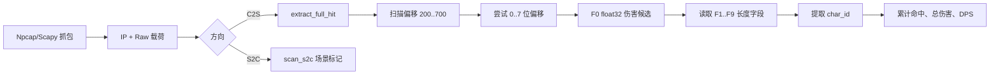

# NTE DPS Meter 逆向分析与整改说明

## 1. 分析对象

- 文件：`NTE_DPS_Meter.exe`
- SHA-256：`6B4871ED4E8B276B0AE3250CED4B9A727C6347C121C25C718BA86DADC54FCFA7`
- MD5：`59E9A3F448D8D3424852EAF308679AF6`
- 打包形式：Nuitka 4.0.5 / Python 3.13 / PySide6
- 分析日期：2026-06-10

本说明基于静态反编译、资源提取和独立最小复现。未对游戏客户端或服务器实施修改、注入或攻击。

## 2. 结论摘要

该程序的伤害、命中数和角色识别数据来自对游戏网络通信的本机抓包与应用层载荷解析，不是通过 `ReadProcessMemory` 等方式读取游戏进程内存。

程序使用 Scapy/Npcap 捕获流量，按客户端到服务器（C2S）方向处理带 `Raw` 层的 IP 包。在没有已识别服务器地址时，其兜底 BPF 为：

```text
tcp port 30031 or udp
```

这意味着捕获范围不只覆盖单一游戏端口，尤其 `or udp` 可能收集同一网卡上与游戏无关的 UDP 包。即使程序只解析部分载荷，原始包进入程序内存和诊断缓冲区本身仍构成不必要的数据接触面。

## 3. 伤害与命中获取方式

核心函数名和模块名可从 Nuitka 本地模块中恢复：

- `engine.sniff_engine.SniffEngine`
- `engine.core.NTECore.packet_callback`
- `engine.core.extract_full_hit`
- `engine.bitstream.decode_shifted_bytes`
- `engine.bitstream.read_field`
- `engine.s2c_parser.scan_s2c`

处理流程如下：



静态反编译恢复出的主要算法特征：

1. 最大扫描边界为 `min(packet_size, 700)`，起始偏移为 `200`。
2. 对每个字节偏移尝试八种 `bit_shift`。
3. 位流按 little-endian 方式重新拼接字节。
4. `F0` 以 `<f` 即 little-endian float32 解析，常量中存在最低值 `2.0`。
5. 后续字段名为 `F1` 到 `F9`。
6. 字段包含分隔值、4 字节长度和数据，长度上限常量为 `64`。
7. 字段会按 `<f`、`<i`、`<d` 分别解释为 float32、int32、float64。
8. `F6`、`F7` 明确存在 int32 解释，`F2` 明确存在 float32 解释。
9. 程序检查包头 `data[10:20]` 的 ASCII 数字作为 `char_id` 来源之一，并使用角色表解析名称。
10. 每个命中对象被追加到命中列表，随后按角色更新 `hit_count`、`total_f0` 和 `char_stats`。

`F0` 被程序作为伤害累计值使用，因此命中数来自成功解析并去重后的命中记录数量，不是读取游戏 UI 文本。

## 4. 是否读取游戏内存

本次分析没有发现以下典型进程内存读取或注入接口：

- `OpenProcess`
- `ReadProcessMemory`
- `WriteProcessMemory`
- `VirtualAllocEx`
- `CreateRemoteThread`
- 调试器附加或 DLL 注入逻辑

相反，发现了完整的 Scapy/Npcap 抓包、BPF、IP/Raw 判断和 C2S/S2C 分流链路。因此当前证据支持“网络封包解析”，不支持“读取游戏内存”。

## 5. 数据收集与上报风险

程序具备将捕获包保存为十六进制诊断 JSON 的功能，反编译文档字符串明确描述：

```text
Write buffered packets to path as JSON (hex-encoded).
Export network diagnostic JSON to workspace/captures/.
```

程序还维护：

- 最多 50,000 条命中记录；
- 最多 10,000 个诊断包缓冲；
- 战斗持续时间、角色统计、场景或副本事件；
- 本地设备标识配置。

需要区分两类行为：

1. **本地收集已确认**：抓包、解析、缓存、导出诊断数据均已确认。
2. **自动秘密上报未确认**：本次静态证据不足以认定程序会在无用户操作时自动上传全部玩家数据。即便上传入口需要用户操作，过宽抓包和原始包导出仍应整改。

## 6. 提取的角色数据

随程序发布目录中存在明文 `data/characters.json`，已原样提取：

- SHA-256：`41BDAB0F0DB82520A0A871AD03864F09D8641353A1D397C0AEF436C82AF8225C`
- 大小：7,859 字节
- 角色 ID 条目：46
- 标记为 `verified: true`：8

文件自身说明其部分 ID 来自数据挖掘并且“未验证”。这说明第三方程序不仅解析实时通信，还维护了非官方角色标识映射。

## 7. 建议官方整改

1. 对客户端战斗通信增加会话级加密与完整性保护，避免仅靠位偏移或字段混淆。
2. 避免在 C2S 包中暴露可稳定关联角色与伤害的固定结构；采用服务端权威统计。
3. 检测并限制未经授权的 Npcap/WinPcap 抓包型统计工具，完善用户协议和处罚边界。
4. 要求第三方工具将 BPF 精确限制为已确认的游戏服务器五元组，禁止使用宽泛的 `or udp`。
5. 禁止默认保存原始载荷；诊断导出应脱敏、最小化并获得单独明确同意。
6. 对设备标识、战斗记录、角色信息、服务器信息的收集目的、保存期限和接收方进行显著披露。
7. 上传功能应默认关闭，并允许用户预览、删除和撤回待上传内容。
8. 审计服务端是否可以通过异常会话、固定字段扫描模式或抓包驱动行为识别此类工具。

## 8. 随附复现材料

`nte_damage_stats/` 包含：

- `nte_damage_stats.py`：最小可运行、无上传功能的独立复现；
- `characters.json`：从发布目录原样提取的角色映射；
- `README.md`：运行方式、算法边界和依赖说明。

该复现用于证明“仅凭本机网络载荷即可恢复角色伤害和命中统计”的技术风险。由于当前没有配套真实 pcap 样本，复现中的误报抑制条件比目标程序更严格；不应将其视为官方协议实现。
